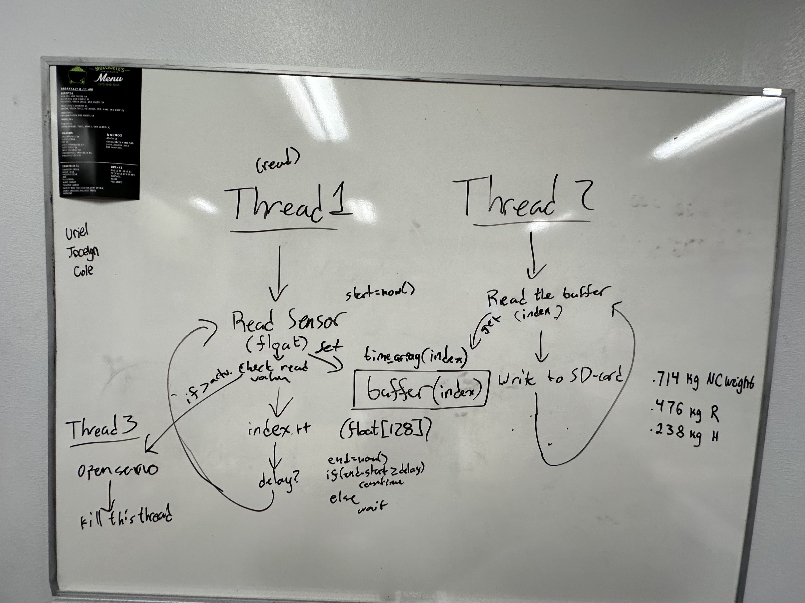

# Airbrakes Controller

Overall, this code acts as a basic flight computer.
It reads and records sensor data from a barometer, accelerometer, and gyroscope.
It can detect when the rocket has launched, and when it has landed based on this sensor data.
It also controls the airbrakes, actuated by a servo or linear actuator.

## Getting Started

This is a PlatformIO project, so it can be opened in VSCode with the PlatformIO extension installed.
The code is written in C++.

## Outline

Above is a basic diagram of the code.
There are three threads.
The first thread reads sensor data and records it to a buffer.
The second thread reads from the buffer and writes it to the SD card.
If records are dropped due to this thread being slow, we forget about them.
The third thread controls the airbrakes based on the sensor data.
It is activated by a signal from the first thread when a specified altitude is reached.
